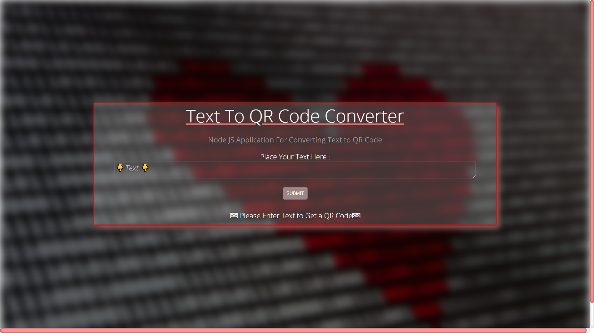

# Text-to-QRCode Converter

A simple NodeJS and ReactJS application which reads text and generates QR Code for it.

 

  

  <h3 align="center">Encrypt your message and send it to your friends</h3>

  

    <a href="https://enigmatic-shore-57208.herokuapp.com/">View Demo</a>
    ·
    <a href="https://github.com/aditya109/qrcode-generator-app/issues/new">Report Bug</a>
    ·
    <a href="https://github.com/aditya109/qrcode-generator-app/issues/new">Request Feature</a>
  

